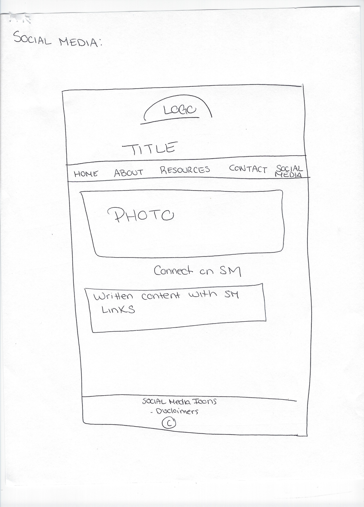

# My INF 7420 Project
I am going to build a site to support a youth literacy initiative project that a colleague and I are currently working on. 

## Wireframes
Here are the wireframes for the projects home, about, resources, contact and social media pages. 

### Home Page

Header - The header will include the logo with name of site below centered on the page.

Navigation - The navigation menu will include links to the sites main pages: home, about, resources, contact, and social media.

Main Content - The main content of the home page will include a prominent image and links to the resources page divided into 2 sections - babies and toddlers.

Footer - The footer will include links to social media accounts, the site disclaimer and copywrite information.

### About Page

Header - The header will include the logo with name of site below centered on the page.

Navigation - The navigation menu will include links to the sites main pages: home, about, resources, contact, and social media.

Main Content - The main content of the about page will provide users with pictures of creators, along with a brief bio and credentials.

Footer - The footer will include links to social media accounts, the site disclaimer and copywrite information.

### Resources Page

Header - The header will include the logo with name of site below centered on the page.

Navigation - The navigation menu will include links to the sites main pages: home, about, resources, contact, and social media.

Main Content - The main content of the resources page with begin with a large banner picture and 3 sets of bulleted lists linking users to outside resources.

Footer - The footer will include links to social media accounts, the site disclaimer and copywrite information.

### Contact Page

Header - The header will include the logo with name of site below centered on the page.

Navigation - The navigation menu will include links to the sites main pages: home, about, resources, contact, and social media.

Main Content - The main content of the contact page will have a large banner image and a list of contact information.

Footer - The footer will include links to social media accounts, the site disclaimer and copywrite information.

### Social Media Page

Header - The header will include the logo with name of site below centered on the page.

Navigation - The navigation menu will include links to the sites main pages: home, about, resources, contact, and social media.

Main Content - The main content of the social media page will be a banner image and a paragraph of content with links to social media sites.

Footer - The footer will include links to social media accounts, the site disclaimer and copywrite information.

